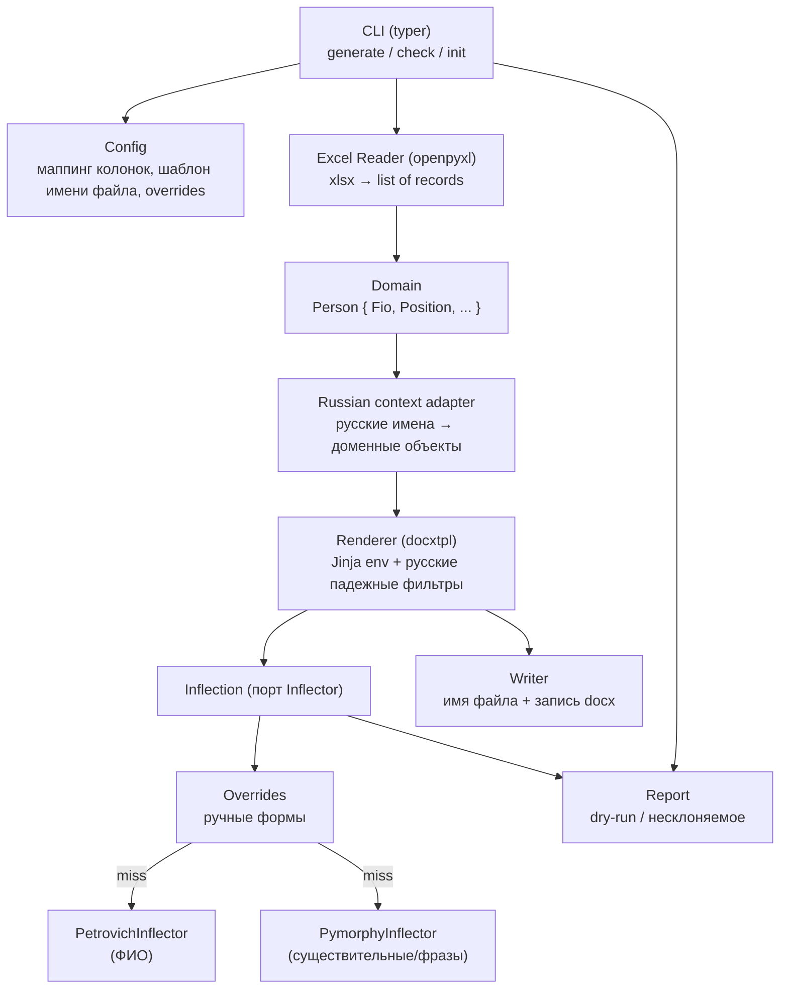
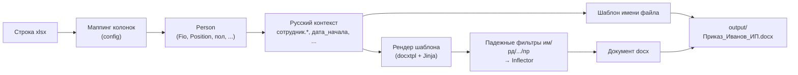
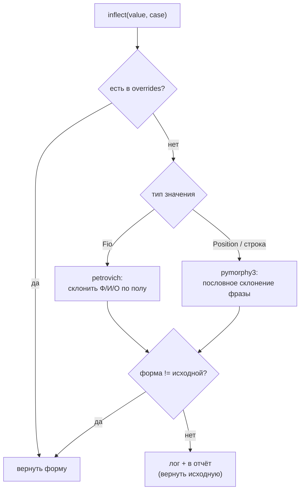

# ТЗ: ДЬЯК — генератор документов с русским склонением

| | |
|---|---|
| **Коднейм** | ДЬЯК (`dyak`) |
| **Версия ТЗ** | v1.1 |
| **Дата** | 21.06.2026 |
| **Статус** | Draft, готов к реализации |
| **Тип** | CLI-утилита, Python 3.11+ |


## 1. Назначение

CLI-инструмент пакетной генерации однотипных документов: на вход подаётся таблица персональных данных (xlsx) и шаблон Word (docx), на выходе — набор документов, по одному на строку таблицы, с корректной подстановкой данных **и автоматическим склонением русских ФИО, должностей и прочих слов по падежам в зависимости от их места в шаблоне**.

Целевой сценарий: кадровое делопроизводство (приказы о назначении, переводе, увольнении, уведомления, справки). Шаблоны разнотипны и создаются пользователем; жёсткого набора шаблонов нет. **Пользователи — не технические специалисты, английским не владеют**, поэтому разметка шаблонов спроектирована полностью на русском языке.

### 1.1. Что входит в scope

- Чтение табличных данных из xlsx с настраиваемым маппингом колонок.
- Шаблонизация docx с устойчивостью к разрезанию плейсхолдеров по run'ам.
- Русскоязычный DSL тегов с указанием целевого падежа в точке подстановки.
- Склонение ФИО (отдельный движок) и произвольных существительных/словосочетаний (общий движок) по 6 падежам.
- Формирование инициалов, в т.ч. в косвенных падежах.
- Согласование причастий/глаголов по полу (назначен/назначена).
- Словарь ручных переопределений склонения (override) для случаев, где автоматика ошибается.
- Шаблонизируемые имена выходных файлов.
- Режим сухой проверки (dry-run) с отчётом о потенциально некорректном склонении до генерации.

### 1.2. Non-goals (v1.1)

- Редактирование/вёрстка самого шаблона — пользователь готовит docx руками.
- Источники данных кроме xlsx (CSV, БД — заложить порт, не реализовывать).
- GUI.
- Полноценный синтаксический анализ предложения для согласования (ограничиваемся пословным склонением + override).

---

## 2. Глоссарий

| Термин | Значение |
|---|---|
| **Падеж (case)** | Грамматическая категория. 6 падежей; внутренне кодируются граммемами pymorphy (`nomn, gent, datv, accs, ablt, loct`), в шаблонах — русскими сокращениями (`им, рд, дт, вн, тв, пр`). |
| **ФИО** | Фамилия + Имя + Отчество как структурированная единица. |
| **Run** | `<w:r>` — атомарный фрагмент текста в docx. Word дробит плейсхолдеры по run'ам. |
| **Инфлектор (Inflector)** | Компонент, склоняющий текст к заданному падежу. |
| **Override** | Словарь ручных форм склонения для конкретных слов. |
| **Declinable** | Доменный объект, умеющий склонять себя (`.inflect(case)`). |

### 2.1. Справочник падежей и фильтров

| Фильтр (шаблон) | Граммема (внутр.) | Падеж | Вопрос | Пример (ФИО / должность) |
|---|---|---|---|---|
| `им` | `nomn` | именительный | кто? что? | Иванов Пётр Семёнович / директор |
| `рд` | `gent` | родительный | кого? чего? | Иванова Петра Семёновича / директора |
| `дт` | `datv` | дательный | кому? чему? | Иванову Петру Семёновичу / директору |
| `вн` | `accs` | винительный | кого? что? | Иванова Петра Семёновича / директора |
| `тв` | `ablt` | творительный | кем? чем? | Ивановым Петром Семёновичем / директором |
| `пр` | `loct` | предложный | о ком? о чём? | (об) Иванове Петре Семёновиче / директоре |

---

## 3. Ключевые архитектурные решения

Три проблемы, которые формируют весь дизайн:

1. **Падеж — свойство места в шаблоне, а не данных.** В таблице ФИО хранится в именительном; в документе оно требуется в разных падежах в зависимости от формулировки. Следствие: падеж кодируется в теге шаблона, а не в источнике.

2. **ФИО и общие слова склоняются разными движками.** Имена собственные требуют профильного инструмента (склонение по полу, несклоняемые фамилии); должности — общего морфологического анализатора. Маршрутизация по типу доменного объекта.

3. **Плейсхолдеры docx рвутся по run'ам.** `{{ фио }}` физически хранится как `{{ фи` + `о }}`. Прямой find-replace по XML ненадёжен. Решается использованием `docxtpl` (Jinja2 поверх `python-docx` с корректной склейкой run'ов). Кириллица в именах фильтров/переменных/атрибутов Jinja поддерживается (проверено на 3.1.6).

---

## 4. Технологический стек

| Назначение | Библиотека | Обоснование |
|---|---|---|
| Рендер docx | `docxtpl` | Jinja2 поверх python-docx, корректная работа с run'ами. Де-факто стандарт. |
| Склонение ФИО | `petrovich` | Профильное склонение Ф/И/О по полу. |
| Склонение существительных | `pymorphy3` + `pymorphy3-dicts-ru` | Поддерживаемый форк pymorphy2; склонение произвольных слов/словосочетаний. |
| Чтение xlsx | `openpyxl` | Легче pandas; для кадровых таблиц numpy не нужен. |
| CLI | `typer` | Декларативный CLI на тайп-хинтах, поверх Click. |
| Конфиг | `pydantic` v2 + `PyYAML` | Валидируемая схема конфигурации. |
| Тесты | `pytest` | — |

Опционально (этап 4): экспорт в PDF через `libreoffice --headless --convert-to pdf` (целевая платформа — Linux).

---

## 5. Архитектура

### 5.1. Слои



### 5.2. Поток обработки одной строки



### 5.3. Маршрутизация склонения



---

## 6. Доменная модель

Доменное ядро использует английские внутренние имена (граммемы pymorphy), а в шаблон выставляется **русскоязычный адаптер контекста** (§8.4).

```python
from enum import Enum

class Case(str, Enum):
    NOMN = "nomn"; GENT = "gent"; DATV = "datv"
    ACCS = "accs"; ABLT = "ablt"; LOCT = "loct"

class Gender(str, Enum):
    MALE = "male"; FEMALE = "female"

# мост: русское сокращение из шаблона → внутренняя граммема
RUS_CASE = {"им": Case.NOMN, "рд": Case.GENT, "дт": Case.DATV,
            "вн": Case.ACCS, "тв": Case.ABLT, "пр": Case.LOCT}
```

**Протоколы:**

```python
from typing import Protocol

class Inflector(Protocol):
    def inflect(self, text: str, case: Case, *, gender: Gender) -> str: ...

class Declinable(Protocol):
    def inflect(self, case: Case) -> str: ...
```

**Fio** — структурированное ФИО, реализует `Declinable` через `PetrovichInflector`. Пол берётся из обязательной колонки таблицы. Шаблонные имена полей (§8.2):

| Тег в шаблоне | Результат («Иванов Пётр Семёнович», им) |
|---|---|
| `сотрудник.фио \| <падеж>` | полное ФИО в падеже: «Иванова Петра Семёновича» (вн) |
| `сотрудник.фамилия \| <падеж>` | «Иванова» (вн) |
| `сотрудник.имя \| <падеж>` | «Петра» (вн) |
| `сотрудник.отчество \| <падеж>` | «Семёновича» (вн) |
| `сотрудник.фио.инициалы` | «Иванов П. С.» (склоняется фамилия) |
| `сотрудник.фио.инициалы_впереди` | «П. С. Иванов» |
| `сотрудник.фио.инициалы_слитно` | «Иванов П.С.» (для имён файлов) |

**Position** — должность (произвольная строка), реализует `Declinable` через `PymorphyInflector` с предварительной проверкой overrides.

**Person** — агрегат: `fio: Fio`, `position: Position`, `gender: Gender`, плюс произвольные дополнительные поля из таблицы (даты, номера приказов и т.п.), доступные в шаблоне по русским именам как простые строки.

---

## 7. Подсистема склонения

### 7.1. ФИО (petrovich)

- Раздельное склонение фамилии, имени, отчества.
- **Пол берётся из обязательной колонки** таблицы (§9, §11). Определение пола по отчеству средствами petrovich используется только как **сверка**: при расхождении с колонкой — предупреждение в отчёт (колонка авторитетна).
- Сборка полной формы и инициалов из просклонённых частей.

### 7.2. Должности и общие слова (pymorphy3)

- Анализатор `MorphAnalyzer` инициализируется один раз (дорого), переиспользуется.
- Словосочетание склоняется **пословно**: токенизация по пробелам/дефису, разбор каждого токена, `.inflect({case})`, сборка обратно. Несклоняемые/неразобранные токены остаются как есть.
- **Известное ограничение:** согласование прилагательного с существительным внутри фразы («заместитель генерального директора») автоматика берёт не всегда корректно. Escape-hatch — override-словарь (§7.3).

### 7.3. Overrides

Словарь ручных форм, проверяется **до** обращения к движкам. Ключ — нормализованный исходный текст (трим, регистронезависимо), значение — формы по падежам (русские сокращения).

```yaml
overrides:
  fio:
    "Дюма": { им: "Дюма", рд: "Дюма", дт: "Дюма",
              вн: "Дюма", тв: "Дюма", пр: "Дюма" }   # несклоняемая
  position:
    "заместитель генерального директора":
      рд: "заместителя генерального директора"
      дт: "заместителю генерального директора"
      вн: "заместителя генерального директора"
```

Частичное задание допускается: указанные падежи берутся из override, остальные — из движка.

### 7.4. Кеширование

`lru_cache` по ключу `(text, case, gender)`. На таблице с повторяющимися должностями устраняет повторный разбор.

---

## 8. DSL шаблонов (русскоязычный)

Разметка полностью на русском: пользователю не требуется ни одного английского слова, только скобки `{{ }}` и символ фильтра `|`. Падеж задаётся фильтром с русским сокращением.

### 8.1. Падежные фильтры

| Фильтр | Падеж |
|---|---|
| `им` | именительный |
| `рд` | родительный |
| `дт` | дательный |
| `вн` | винительный |
| `тв` | творительный |
| `пр` | предложный |

### 8.2. Объект и поля

| Тег | Назначение |
|---|---|
| `сотрудник.фио` | полное ФИО (склоняется) |
| `сотрудник.фамилия` / `.имя` / `.отчество` | части ФИО отдельно (склоняются) |
| `сотрудник.должность` | должность (склоняется) |
| `сотрудник.фио.инициалы` | «Иванов П. С.» |
| `сотрудник.фио.инициалы_впереди` | «П. С. Иванов» |
| `сотрудник.фио.инициалы_слитно` | «Иванов П.С.» (для имён файлов) |
| доп. колонки (`дата_начала`, `номер_приказа`, …) | подстановка строкой как в таблице |

### 8.3. Вспомогательный фильтр согласования по полу

| Конструкция | Результат (пол = ж) |
|---|---|
| `{{ сотрудник \| согл('назначен', 'назначена') }}` | «назначена» |
| `{{ сотрудник \| согл('ознакомлен', 'ознакомлена') }}` | «ознакомлена» |

Первый аргумент — мужская форма, второй — женская. Имя `согл` намеренно не пересекается с падежными сокращениями.

### 8.4. Реализация (адаптер контекста)

Renderer регистрирует русские фильтры и подаёт в Jinja-контекст русскоязычное представление `Person`:

```python
env.filters.update({rus: make_case_filter(case) for rus, case in RUS_CASE.items()})
env.filters["согл"] = lambda emp, m, f: f if emp.gender is Gender.FEMALE else m
# контекст: {"сотрудник": <русский фасад Person>, "дата_начала": "...", ...}
```

Каждый падежный фильтр вызывает `value.inflect(case)` на `Declinable`-объекте.

### 8.5. Пример шаблона (так пишет кадровик)

```jinja
ПРИКАЗ № {{ номер_приказа }} от {{ дата_приказа }}

Назначить {{ сотрудник.фио | вн }} на должность {{ сотрудник.должность | рд }}
с {{ дата_начала }}.

{{ сотрудник.фио.инициалы_впереди }} {{ сотрудник | согл('ознакомлен', 'ознакомлена') }}.
```

### 8.6. Поведение при ошибках шаблона

Jinja-окружение настраивается на `StrictUndefined`: обращение к несуществующей переменной → явная ошибка с именем переменной, а не молчаливая пустая подстановка. `dyak init` кладёт в пример шаблона шпаргалку по сокращениям `им/рд/дт/вн/тв/пр` комментарием.

---

## 9. Конфигурация

Файл `dyak.yaml`, валидируется pydantic-моделью.

```yaml
# маппинг колонок таблицы → доменные поля
columns:
  surname: "Фамилия"
  name: "Имя"
  patronymic: "Отчество"
  position: "Должность"
  gender: "Пол"          # ОБЯЗАТЕЛЬНАЯ
  # произвольные доп. поля доступны в шаблоне по русскому имени-ключу
  дата_начала: "Дата начала"
  номер_приказа: "Номер приказа"
  дата_приказа: "Дата приказа"

# распознавание значений пола в колонке
gender_values:
  male:   ["м", "муж", "мужской"]
  female: ["ж", "жен", "женский"]

# шаблон имени выходного файла (тот же Jinja-движок, русские теги)
filename: "Приказ_{{ сотрудник.фамилия | им }}_{{ сотрудник.фио.инициалы_слитно }}.docx"

overrides:
  fio: {}
  position: {}
```

Pydantic-модели: `Config { columns: ColumnMap, gender_values: GenderValues, filename: str, overrides: Overrides }`. Неизвестные ключи → ошибка валидации. **Колонки `surname/name/patronymic/position/gender` обязательны.**

---

## 10. CLI

```
dyak generate --table employees.xlsx --template order.docx --out ./output
              [--config dyak.yaml] [--sheet "Лист1"]

dyak check    --table employees.xlsx --template order.docx [--config dyak.yaml]
              # сухой прогон: валидация колонок (включая пол), рендер в память,
              # отчёт о словах, которые не просклонялись, и о расхождении пола

dyak init     [--dir .]
              # scaffold: dyak.yaml + пример шаблона (со шпаргалкой падежей) + пример таблицы
```

| Команда | Назначение |
|---|---|
| `generate` | Полная генерация набора документов. |
| `check` | Проверка без записи: ловит проблемы склонения, отсутствие пола и битый маппинг до генерации сотни файлов. |
| `init` | Создание стартового конфига и примеров. |

---

## 11. Подсистема ввода (Excel)

- Первая строка листа — заголовки.
- Колонки сопоставляются по `config.columns` (по человекочитаемым заголовкам).
- Валидация перед обработкой:
  - наличие обязательных колонок: фамилия, имя, отчество, должность, **пол**;
  - пустые обязательные ячейки → ошибка с номером строки;
  - **значение пола** распознаётся по `gender_values`; нераспознанное/пустое → ошибка с номером строки.
- Лист выбирается `--sheet` или берётся активный.

---

## 12. Подсистема вывода

- **Даты и прочие доп. поля подставляются строкой ровно как в ячейке таблицы**, без переформатирования.
- Имя файла рендерится Jinja-движком из `config.filename`.
- Защита от коллизий имён: при совпадении — суффикс `_2`, `_3`, … + предупреждение.
- Запись в `--out` (создаётся при отсутствии).
- **Опционально (этап 4):** конвертация в PDF через LibreOffice headless.

---

## 13. Обработка ошибок и краевые случаи

| Ситуация | Поведение |
|---|---|
| Нет обязательной колонки (вкл. пол) | Падение до обработки, явное сообщение. |
| Пустая обязательная ячейка | Ошибка с номером строки. |
| Нераспознанное значение пола | Ошибка с номером строки. |
| Пол из колонки ≠ пол по отчеству | Предупреждение в отчёт; используется колонка. |
| Пустое опциональное поле | Пустая подстановка (или дефолт из конфига). |
| Слово не склонилось (форма == исходной) | Override если есть; иначе предупреждение + исходная форма + запись в отчёт. |
| Несклоняемая фамилия | Через override. |
| Неизвестная переменная в шаблоне | `StrictUndefined` → ошибка с именем. |
| Коллизия имён файлов | Числовой суффикс + предупреждение. |

---

## 14. Тестирование

- **Регрессионные фикстуры склонения:** CSV-таблица «исходник + пол → ожидаемые формы по 6 падежам», покрывающая: женские фамилии, окончания -ко/-их/-ых, иностранные, составные должности, отчества обоих родов.
- **Golden-file тесты рендера:** эталонный docx → сравнение извлечённого текста.
- **Тесты русского DSL:** все 6 падежных фильтров + `согл` для обоих полов.
- **Тесты маппинга и валидации** ввода (включая обязательность и распознавание пола).
- **Тесты override-приоритета** (override перекрывает движок).

---

## 15. Нефункциональные требования

| Категория | Требование |
|---|---|
| Платформа | Linux (основная), кросс-платформенность кроме опционального PDF. Чистый Python. |
| Python | 3.11+. |
| Локализация | Разметка шаблонов и сообщения CLI — на русском. |
| Производительность | Сотни–тысячи строк за секунды. Анализатор pymorphy — один раз; склонение кешируется. |
| Детерминированность | Один и тот же вход → побитово тот же набор документов. |
| Расширяемость | Источник данных и инфлекторы — за портами; добавление CSV/БД и альт. движков без правки ядра. |

---

## 16. Структура проекта

```
dyak/
├── pyproject.toml
├── dyak/
│   ├── __init__.py
│   ├── cli.py                  # typer: generate / check / init
│   ├── config.py               # pydantic-модели, загрузка YAML
│   ├── domain.py               # Person, Fio, Position, Gender, Case, RUS_CASE
│   ├── inflection/
│   │   ├── ports.py            # Inflector, Declinable
│   │   ├── petrovich_fio.py
│   │   ├── pymorphy_phrase.py
│   │   ├── overrides.py
│   │   └── cache.py
│   ├── io/
│   │   ├── excel.py            # чтение + маппинг + распознавание пола
│   │   └── naming.py           # шаблон имени файла
│   ├── render/
│   │   ├── engine.py           # обёртка docxtpl + Jinja env
│   │   ├── context.py          # русскоязычный фасад Person
│   │   └── filters.py          # русские падежные фильтры, согл, инициалы
│   └── report.py               # отчёт dry-run / несклоняемое / расхождение пола
├── tests/
│   ├── fixtures/
│   │   └── declension.csv
│   ├── test_inflection.py
│   └── test_render.py
└── examples/
    ├── dyak.yaml
    ├── order_template.docx
    └── employees.xlsx
```

---

## 17. План реализации

| Этап | Содержание | Результат |
|---|---|---|
| **0. Скелет** | Чтение xlsx, docxtpl-рендер без склонения, `generate`. | Пайплайн «таблица → документы» на простой подстановке. |
| **1. ФИО** | `petrovich`, 6 русских падежных фильтров, инициалы (3 формы), пол из колонки. | Корректное склонение имён. |
| **2. Должности** | `pymorphy3` пословно, override-словарь, кеш. | Склонение произвольных существительных. |
| **3. Надёжность** | `check`/dry-run + отчёт, фильтр `согл`, `StrictUndefined`, сверка пола. | Контроль качества до генерации. |
| **4. Опции** | PDF-экспорт, `init`-scaffold со шпаргалкой, оптимизация. | Полировка. |

---

## 18. Риски и открытые вопросы

| # | Риск / вопрос | Статус / решение |
|---|---|---|
| R1 | Согласование внутри составных должностей не всегда корректно. | Override-словарь; `check` выявляет проблемные до генерации. |
| R2 | Несклоняемые/иностранные фамилии. | Override; авто-детект в отчёт `check`. |
| R3 | Качество словаря pymorphy на редких словах. | Override как финальный авторитет. |
| ~~Q1~~ | ~~Обязательность колонки пола~~ | **Закрыт: пол обязателен.** |
| ~~Q2~~ | ~~Формат дат~~ | **Закрыт: строкой как в таблице.** |

---

## 19. Приложение А. Зависимости

```toml
[project]
requires-python = ">=3.11"
dependencies = [
    "docxtpl",
    "python-docx",
    "petrovich",
    "pymorphy3",
    "pymorphy3-dicts-ru",
    "openpyxl",
    "typer",
    "pydantic>=2",
    "pyyaml",
]

[dependency-groups]
dev = ["pytest"]
```

---

## 20. Приложение Б. Сквозной пример

**`employees.xlsx`:**

| Фамилия | Имя | Отчество | Должность | Пол | Дата начала | Номер приказа |
|---|---|---|---|---|---|---|
| Иванов | Пётр | Семёнович | директор | м | 01.07.2026 | 17 |
| Петрова | Анна | Сергеевна | главный бухгалтер | ж | 01.07.2026 | 18 |

**Шаблон (фрагмент):**
```jinja
Назначить {{ сотрудник.фио | вн }} на должность {{ сотрудник.должность | рд }}
с {{ дата_начала }}. {{ сотрудник.фио.инициалы_впереди }} {{ сотрудник | согл('назначен','назначена') }}.
```

**Выход (2 файла):**
```
Приказ_Иванов_ИП.docx:
  Назначить Иванова Петра Семёновича на должность директора
  с 01.07.2026. П. С. Иванов назначен.

Приказ_Петрова_АС.docx:
  Назначить Петрову Анну Сергеевну на должность главного бухгалтера
  с 01.07.2026. А. С. Петрова назначена.
```

*(Строка с «главным бухгалтером» в родительном — кандидат на проверку через `check`: согласование прилагательного. При сбое — в override.)*